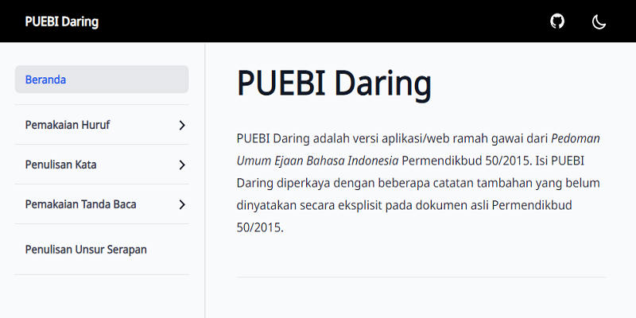

# Pedoman Umum Ejaan Bahasa Indonesia



---

> Per tanggal 16 Agustus 2022, PUEBI sudah tidak digunakan dan digantikan dengan [EYD (Edisi Kelima)](https://eyd.netlify.app).

---

## Fitur

- Mode gelap
- Mode luring
- Bebas iklan
- Bebas Google Analytics

---

## Instalasi

Buka [`puebi.js.org`](https://puebi.js.org) untuk masuk ke web.

- **Ponsel**: klik _`Add PUEBI to Home screen`_ dari notifikasi munculan atau pasang manual lewat bilah menu.
- **Komputer**: tergantung jenis dan versi peramban yang Anda gunakan, tetapi umumnya dengan klik ikon `(+)` di bilah navigasi (tempat mengetik tautan) kemudian klik _`Install`_.

Peramban yang didukung:

Firefox, Safari, dan peramban berbasis Chromium (Brave, Chrome, Edge, Opera, dst.) dua versi di bawah versi termutakhir.

---

### Pengembangan

Situs web PUEBI Daring dibuat menggunakan [Next.js 13](https://nextjs.org), [React 18](https://reactjs.org), dan [Tailwind CSS 3](https://tailwindcss.com). Untuk mengembangkan secara lokal, Anda butuh [Node.js 16.13+](https://nodejs.org) terpasang di komputer.

```
yarn
yarn dev
```

---

### Hak Cipta dan Lisensi

Hak cipta PUEBI dimiliki oleh Badan Pengembangan dan Pembinaan Bahasa Republik Indonesia.
Seluruh konten dalam situs web PUEBI Daring dilisensikan di bawah [CC BY-SA 4.0](https://puebi.js.org/lisensi). Kode sumber dilisensikan di bawah [Lisensi MIT](LICENSE).
