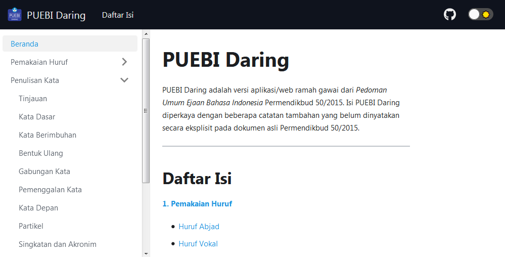

## Pedoman Umum Ejaan Bahasa Indonesia

<p align="center">
  
</p>
<br />

Proyek ini adalah pengembangan dari PUEBI Daring buatan [Ivan Lanin](https://github.com/ivanlanin/puebi) dengan penambahan fitur dan penerapan [web modern](https://jamstack.org/what-is-jamstack/).

Ini tersedia dalam bentuk web, tetapi dirancang untuk dijalankan sebagai [Aplikasi Web Progresif](https://web.dev/what-are-pwas/). PUEBI Daring bisa dipasang di ponsel maupun komputer.

---

## Fitur

- [Aplikasi satu halaman](https://en.wikipedia.org/wiki/Single-page_application)
- Responsif
- Mode gelap
- Mode luring
- Bebas iklan (ini penting)
- Bebas Google Analytics ([ini lebih penting](https://plausible.io/blog/google-analytics-and-privacy))

---

## Instalasi

Buka [`https://puebi.js.org`](https://puebi.js.org) untuk masuk ke web.

- **Ponsel**: klik *`Add PUEBI to Home screen`* dari notifikasi munculan atau pasang manual lewat bilah menu.
- **Komputer**: tergantung jenis dan versi peramban yang Anda gunakan, tetapi umumnya dengan klik ikon `(+)` di bilah navigasi (tempat mengetik tautan) kemudian klik *`Install`*.

Peramban yang didukung:

- **iOS**: Safari
- **Android/Windows**: Chrome, Edge

Secara teknis, jika peramban Anda mendukung, versi web dan aplikasi sama-sama menerapkan mode luring. Keduanya memanfaatkan tembolok (*cache*) dan akan otomatis mengunduh aset statis (kurang dari 500KB) pada kunjungan pertama. Jadi selama Anda tidak menghapus tembolok di peramban, Anda selalu bisa mengakses konten di versi web/aplikasi tanpa internet.

**Catatan**: mode luring hanya menyimpan laman internal. Semua tautan eksternal tidak akan aktif di mode luring.

---

### Pengembangan

PUEBI Daring dirakit menggunakan [Docusaurus v2](https://v2.docusaurus.io). Untuk mengembangkan secara lokal, Anda butuh [Node.js](https://nodejs.org) dan [Yarn](https://classic.yarnpkg.com) terpasang di komputer.

```
$ git clone https://github.com/gipsterya/puebi.git
$ cd puebi
$ yarn
$ yarn start
```

Secara otomatis peramban akan masuk ke `http://localhost:3000` untuk memulai mode pengembangan.

Antarmuka ditulis dengan [React](https://reactjs.org). Konten ditulis dalam format [MDX](https://mdxjs.com).

---

### Hak Cipta dan Lisensi

Hak cipta PUEBI dimiliki oleh Badan Pengembangan dan Pembinaan Bahasa Republik Indonesia. 
Seluruh konten dalam situs PUEBI Daring dilisensikan di bawah [CC BY-SA 4.0](https://creativecommons.org/licenses/by-sa/4.0/deed.id) (turunan lisensi dari [Ivan Lanin](https://github.com/ivanlanin/puebi)). 
Kode sumber dilisensikan di bawah [Lisensi MIT](LICENSE).
