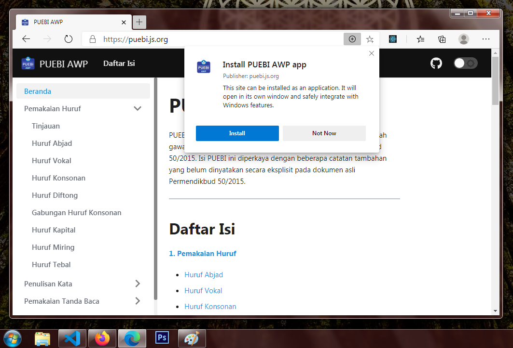
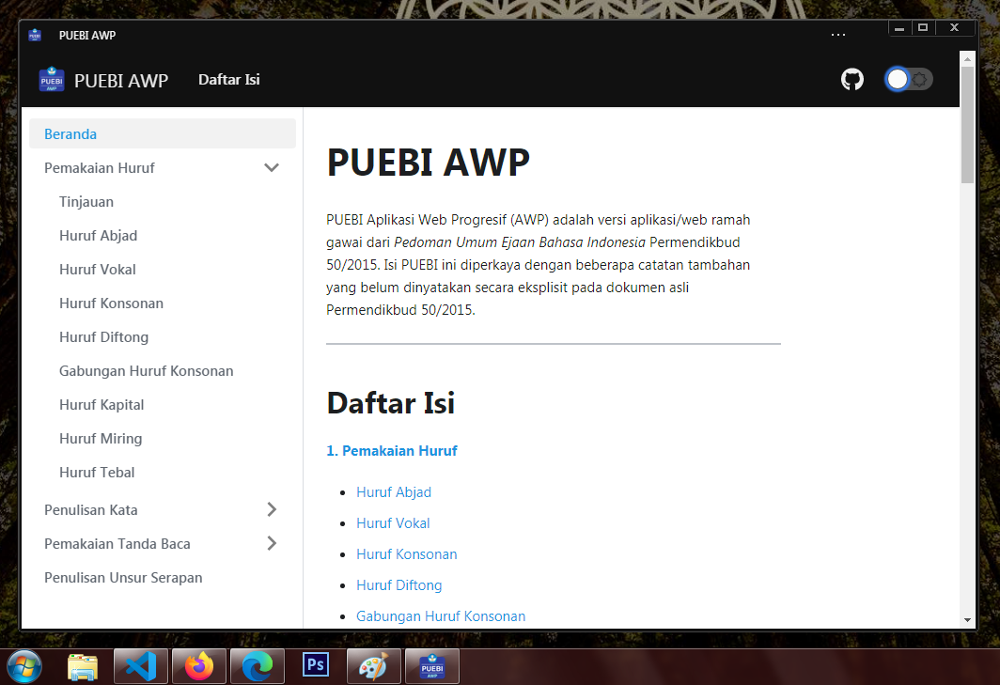

## Instalasi di Windows

Berikut ini adalah contoh instalasi di Windows 7 Ultimate (32-bit) menggunakan Microsoft Edge versi 87. Jika Anda menggunakan Google Chrome, tampilannya mungkin akan sedikit berbeda, tetapi caranya sama saja.

**1. Buka situs web PUEBI AWP**

Kunjungi [https://puebi.js.org](https://puebi.js.org) untuk masuk ke web. Jika peramban Anda mendukung, di bilah navigasi akan muncul ikon `(+)` untuk instalasi. Klik ikon tersebut dan klik *`Install`*.

**2. Matikan internet**

Setelah terpasang, aplikasi akan terbuka secara otomatis. Untuk menguji aplikasi berjalan dengan benar, tutup aplikasi PUEBI AWP dan matikan koneksi internet Anda. Sekarang tekan ikon Windows dari papan ketik dan cari aplikasi PUEBI AWP, lalu buka dan cobalah untuk menavigasi. Jika pemasangan berjalan dengan benar, aplikasi bisa diakses tanpa jaringan internet.

Dan, selamat! Instalasi selesai.

---

**Catatan**:

1. Instalasi di Android jauh lebih mudah, jadi saya pikir tidak perlu memberi contoh.
2. Saya tidak punya iPhone, tetapi saya baca-baca iOS mendukung AWP via Safari. Hanya saja teknisnya saya kurang paham. Jadi sila ulik sendiri.
3. Jika kamu butuh bantuan atau mau tanya sesuatu, bisa *Open Issue* di repositori ini atau hubungi saya via Twitter @gipsterya.

Terima kasih.